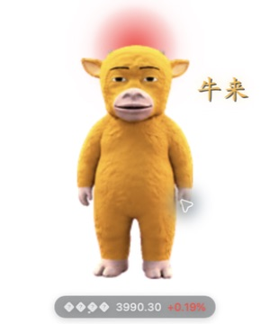
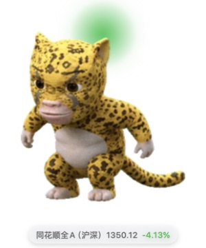
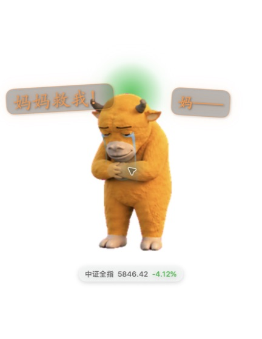
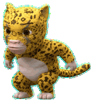
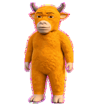

# NiuLai Market Pets

牛来行情宠物是一个完全独立的 macOS 桌面悬浮宠物：行情变化时，它会自动变形、发光、出声。桌面上始终只显示一只宠物，可通过右键菜单或顶部状态栏切换目标、形态、大小、台词字号、轮询和静音。

它不要求其他桌面软件、配置文件或外置资源目录；三套宠物、动效和本地音效都随应用包发布。macOS 支持 13+；Windows 1.1.0 提供 Windows 10/11 `win-x64` 独立 WPF 安装器和 ZIP。

## 最新版本：Windows 1.1.0

Windows 1.1.0 是本项目首次面向普通 Windows 用户的完整桌面版发布：双击安装、开始菜单卸载、原地升级和应用内检查更新都已打通。它只支持 Windows 10/11 `win-x64`，不需要管理员权限，也不包含 ARM64、MSIX、商店发布或后台静默更新。

- [下载 Windows 安装器](https://github.com/callhong/niulai-market-pets/releases/download/v1.1.0/NiuLaiMarketPets-windows-x64-setup.exe) · [下载便携 ZIP](https://github.com/callhong/niulai-market-pets/releases/download/v1.1.0/NiuLaiMarketPets-windows-x64.zip) · [查看 SHA256](https://github.com/callhong/niulai-market-pets/releases/tag/v1.1.0)
- 透明置顶的单宠物悬浮窗、真实 WebP 帧动画、牛头托盘图标、宠物右键菜单和托盘气泡降级。
- 六个固定指数、同花顺微盘股 `883418` 指标，以及可长期保存的股票/ETF 自选池；行情名称从返回数据更新，不再显示错误名称。
- 红涨、绿跌、零值/离线/过期灰色，头部贴近式柔光；自动形态边界、声音、静音、台词气泡和行情标签规则与验收结果一致。
- 中文安装器、中文菜单、原地升级、卸载回滚、当前用户开机启动和原子配置持久化。

Windows 安装包没有商业 Authenticode 签名。首次下载请先用 Release 页面提供的 SHA256 校验文件；如果 SmartScreen 提示“Windows 已保护你的电脑”，按系统的“更多信息 → 仍要运行”继续，不要关闭 SmartScreen。

## 自动变形 + 光效 + 音效

自动模式严格按所选指数的涨跌幅切换：

| 涨跌幅 | 形态 | 光效 | 音效 |
| --- | --- | --- | --- |
| 小于 0% | 牛妈 | 绿色光晕 | 妈妈拖长音或妈妈救我 |
| 0% 到 1%（含边界） | 牛来 | 红色光晕 | 牛来 |
| 大于 1% | 豹拉 | 红色光晕 | 豹拉 |

切换包含防抖、冷却、交易时段判断、主备行情源和离线降级；临界值变化、手动切换和开盘后的首次有效行情都可以播放音效。静音按钮可以随时关闭声音，设置会持久化。

## 最新预览

| 牛来：微涨时奔跑（红光） | 豹拉：上涨时直线上跳（红光） | 牛妈：下跌时流泪（绿光） |
| --- | --- | --- |
|  |  |  |

自动形态切换会把不同台词气泡分散飘出；点击宠物会快速连击台词并随机播放对应声音：

动效预览：

最新 36 秒实机录屏（上涨 `+1.77%` 自动切换豹拉、红光与行情胶囊）：

<video src="assets/showcase/niulai-market-pets-demo.mp4" controls muted playsinline width="320"></video>

[打开或下载 MP4 录屏](assets/showcase/niulai-market-pets-demo.mp4)

## 功能

- 单宠物悬浮窗：牛来、豹拉、牛妈不会同时显示。
- 自动模式和手动模式；手动模式优先于自动切换。
- 上证指数、中证全指、同花顺全 A（沪深）、创业板指、科创 50、国证 2000。
- 指数菜单额外支持同花顺 `883418` 微盘股，也可手动输入任意 6 位同花顺代码；它不加入六个固定指数的 60 秒轮询。
- 统一规则：小于 `0%` 为牛妈，`0%～1.00%` 为牛来，大于 `1.00%` 为豹拉；涨为红色，跌为绿色，零值、离线和过期为灰色。
- 轮询指数每 60 秒推进一个目标；轮询开启后与具体指数选择互斥。
- 间歇台词气泡、点击连击台词、红涨绿跌光晕和四个本地 WAV 音效；点击、手动切换和真正的形态变化会按静音设置播放。
- 一级菜单可独立勾选“显示行情标签”，关闭后只隐藏宠物下方的指数、点数和涨跌幅标签。
- 宠物大小和台词字号都使用百分比滑块调节。
- 顶部状态栏与右键菜单保持一致的两级入口：形态、指数。
- 登录启动、状态持久化、行情故障降级和可回滚安装。

## 直接安装

从 [Releases](https://github.com/callhong/niulai-market-pets/releases) 下载最新 DMG，打开后双击 Install NiuLai Market Pets.command。安装器会将独立应用放入当前用户的 Applications 目录，并安装用户级 LaunchAgent。

也可以直接下载当前版本：[NiuLaiMarketPets-1.0.4.dmg](https://github.com/callhong/niulai-market-pets/releases/download/v1.0.4/NiuLaiMarketPets-1.0.4.dmg)。

安装器会：

- 将宠物资源和 WAV 音效内置在应用包中，不再写入外置宠物目录；
- 将运行状态、日志和安装回滚备份保存到 ~/Library/Application Support/NiuLaiMarketPets；
- 发现旧的同产品 LaunchAgent 时先停用并备份，避免两个悬浮控制器同时运行；
- 安装失败时保留备份，卸载时恢复安装前的应用与 LaunchAgent。

首次打开如果 macOS 提示来自未验证开发者，请在系统设置的隐私与安全性中允许打开。公开 Release 默认使用本地临时签名，未配置 Apple Developer 公证。

### Windows 极简安装、升级与卸载

从 [v1.1.0 Release](https://github.com/callhong/niulai-market-pets/releases/tag/v1.1.0) 下载 `NiuLaiMarketPets-windows-x64-setup.exe`，双击即可安装到当前用户目录，不需要管理员权限。已经安装过旧版本时，直接运行新的安装器即可原地升级，不必先卸载；`%APPDATA%\NiuLaiMarketPets\config.json` 会保留。开始菜单中的“卸载 牛来行情宠物”可完整卸载应用并保留可回滚配置。便携 ZIP 仍可用于不登记安装的临时运行。

应用菜单和托盘菜单中的“检查更新…”会查询 GitHub Release；发现带 SHA256 文件的 Windows 安装器后，用户确认即可下载、校验并启动安装器。它不做后台静默更新，也不绕过 Windows Defender SmartScreen。无商业签名时，若出现“Windows 已保护你的电脑”，先校验发布页 SHA256，再按系统提示处理。

## 从源码构建

需要 macOS 13+、Swift 5.10+ 工具链、jq 和 Xcode Command Line Tools。

    swift test
    swift run NiuLaiMarketPetsTests
    ./scripts/validate-public.sh
    ./scripts/build-app.sh
    ./scripts/build-dmg.sh

回归 harness 输出 swift-test-harness: PASS。DMG 构建只包含应用包、安装命令和必要模板；应用包内部已经包含三套宠物、音效和资源清单。

从源码安装：

    ./scripts/install.sh

卸载并恢复安装前状态：

./scripts/uninstall.sh

Windows 构建：

    dotnet test platforms/windows/NiuLaiMarketPets.Windows.Tests/NiuLaiMarketPets.Windows.Tests.csproj -c Release
    cd platforms/windows && dotnet publish -c Release -r win-x64 --self-contained true

Windows 的 CI 会在 `main` 和功能分支上测试、发布 `win-x64`、构建安装器并上传 artifact；`v1.1.0` Release 同时提供 ZIP、安装器和 SHA256。Windows 核心测试消费 `platforms/shared/market-model-cases.json`，CI 成功标记为 `WINDOWS_BUILD_PASS`，Windows GUI 已完成用户实机验收并标记为 `WINDOWS_VISUAL_PASS`。

卸载脚本不会删除回滚备份；如需彻底清理，可在确认不再需要恢复后手动删除 ~/Library/Application Support/NiuLaiMarketPets。

## 项目状态

macOS 当前公开版本为 1.0.4，Windows 当前公开版本为 1.1.0。行情提供商使用公开网页接口，接口变更、休市和网络故障都可能导致报价离线或短暂过期；界面会保留最后一个有效报价并将过期值置灰。本项目是娱乐化可视化，不构成投资建议。

## 参与贡献

欢迎提交 bug、需求、截图、动效、音效和二创宠物。请先阅读 [CONTRIBUTING.md](CONTRIBUTING.md)，涉及音频、影视画面或角色素材时同时补充授权说明。欢迎需求建议、问题反馈和 Pull Request。

## 路线图

见 [ROADMAP.md](ROADMAP.md)。后续候选包括自建指数、KDJ、均线、日内择时提醒，以及“牛回速归”“上车再补票”等抽象提示。

## 目录说明

- Sources/NiuLaiMarketPets：行情、规则、状态、音频和宠物控制核心。
- Sources/NiuLaiMarketPetsApp：原生 macOS 悬浮窗、状态栏和右键菜单。
- assets/pets：三套宠物源资源；构建时会内置进应用包。
- Resources/Audio：公开发布的本地音效。
- platforms/windows：WPF + .NET 8 Windows 桌面端、模型测试、发布和卸载说明。
- platforms/shared：macOS 与 Windows 共同消费的行情模型测试样例。
